# Destiny App

A native macOS app for Vedic (sidereal, Lahiri ayanamsa) astrology: birth
chart calculation, all divisional charts (D1-D60), Vimshottari and Chara
Dasha (down to the Pratyantardasha level, with the currently-running
period highlighted), contextual per-chart analysis (doshas, conjunctions,
aspects, karakas, Arudha Padas), and a live transit scrubber -- all
computed locally via a vendored Swiss Ephemeris, no network access
required.

## Features

- Birth chart calculation (Ascendant, planetary positions, nakshatras +
  padas, retrograde/combustion) via Swiss Ephemeris, sidereal/Lahiri.
- All divisional charts D2 through D60, each with its own genuinely
  varga-specific degree/nakshatra data (not repeated D1 values).
- North Indian and South Indian chart diagram styles, with hover
  highlighting of a planet's Graha Drishti aspects.
- Vimshottari Dasha and Chara Dasha, 3 levels deep (Mahadasha /
  Antardasha / Pratyantardasha), with the period containing today's date
  highlighted and auto-expanded at every level.
- Analysis panels alongside each chart (D1 and every divisional chart):
  conjunctions, graha drishti, rashi drishti, and house lordships,
  collapsible per section. D1 additionally shows Mangal dosha (Lagna-only,
  with the triggering house), Sarpa dosha, the 7-karaka (Jaimini) scheme,
  all 12 Arudha Padas, and Karakamsa.
- Export PDF: pick a chart style (North Indian/South Indian/both) and any
  subset of D1 + divisional charts to export as a light/print-themed PDF
  -- a cover page with birth details and D1's doshas/Karakamsa/Arudha
  Padas/Chara Karakas, then a diagram + planetary-positions table per
  selected chart.
- Independent chart-size zoom (+/- control, separate from text zoom),
  alongside North/South Indian style and D1 + every divisional chart on
  one shared page/picker.
- Explore Transits: a read-only view that scrubs a saved chart's date/time
  forward or backward (day/hour/minute/second granularity, by scrolling
  over the chart) and live-recomputes planetary positions -- never
  modifies the original saved chart.
- Fully offline place-of-birth search (bundled GeoNames extract).
- 30 built-in color/text themes (including several based on well-known
  editor themes), plus independent text zoom (Cmd +/-).
- Sidebar search across saved charts by name, place of birth, gender, or
  date/time of birth; supports selecting and importing multiple chart
  JSON files at once.
- Charts are saved as plain JSON files (just name/place/date/time/gender),
  recomputed fresh on every load rather than caching derived output.
  Deleting a chart moves its file to the Trash rather than deleting it
  permanently.

## Screenshots

### Charts page
Sidebar search, the D1 chart (South Indian style shown here), doshas/
Karakamsa/Arudha Padas/Chara Karakas/House Lordships, conjunctions/aspects,
and the planetary positions table.

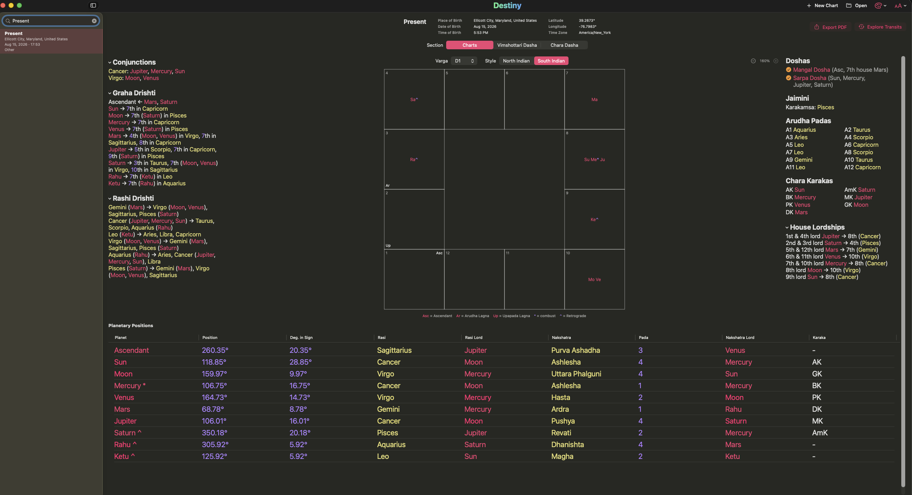

### Varga picker
D1 sits alongside every divisional chart (D2-D60) in one picker on the
same page -- selecting a different one swaps the diagram, analysis
panels, and table together.

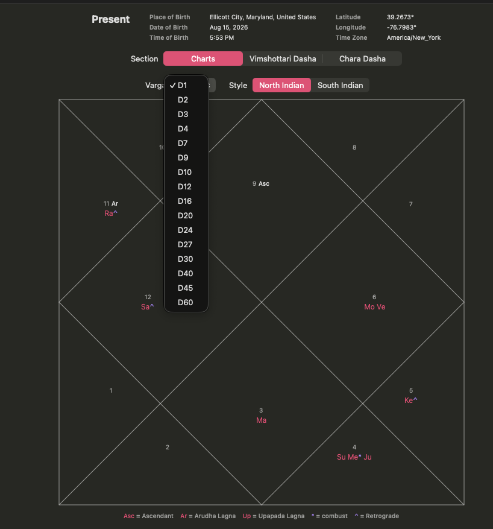

### Hover highlighting, North Indian vs. South Indian
Hovering a planet highlights its own house and every house it aspects
(Graha Drishti), using each house's actual diamond/triangle shape on the
North Indian chart -- not an approximated box.

| North Indian | South Indian |
|---|---|
| 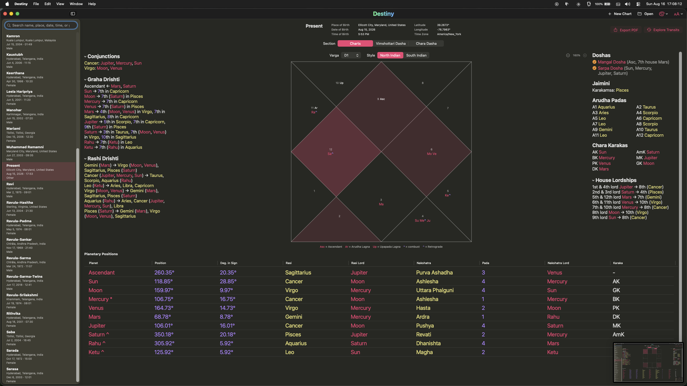 | 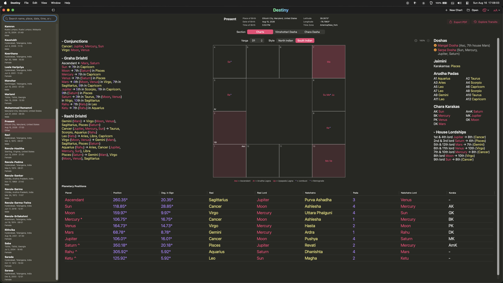 |
| 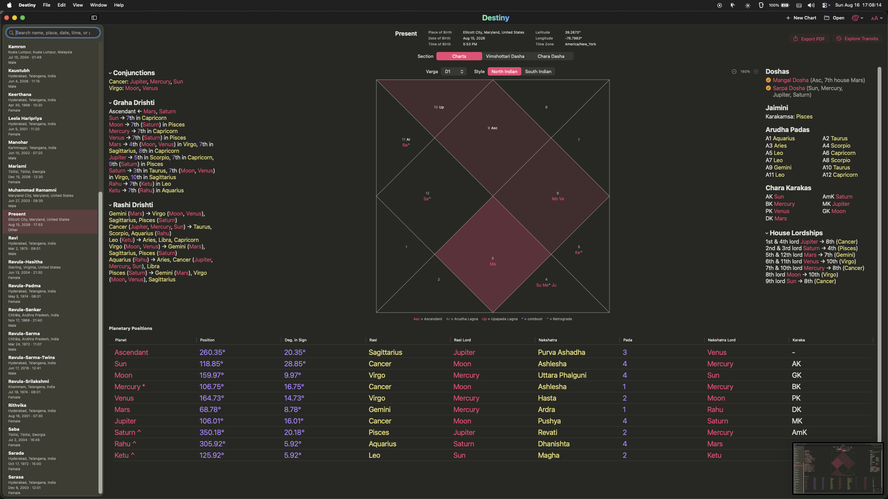 | 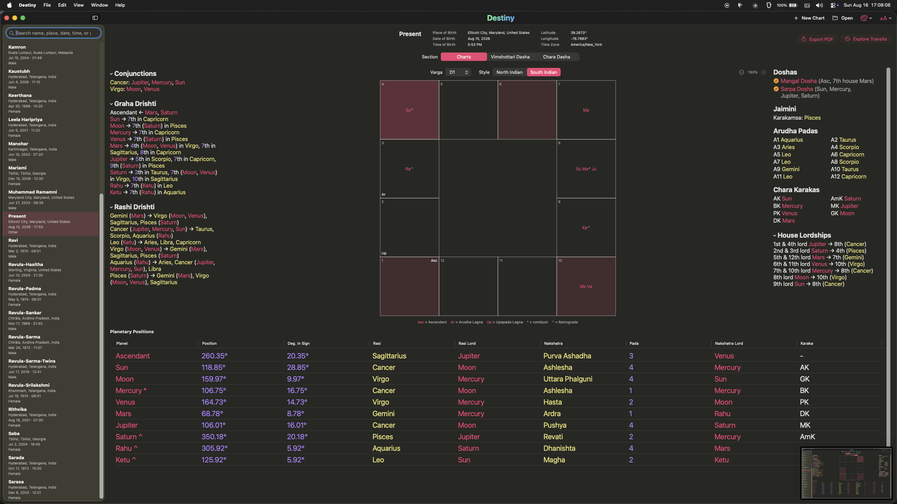 |

### Vimshottari Dasha
Mahadasha/Antardasha/Pratyantardasha, auto-expanded to and highlighting
the period containing today's date.

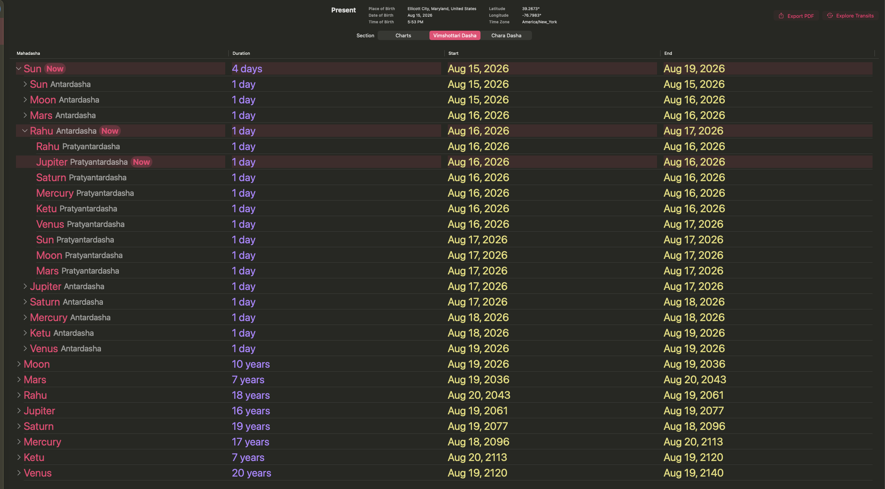

### Chara Dasha
Same current-period auto-expand/highlight behavior as Vimshottari Dasha.

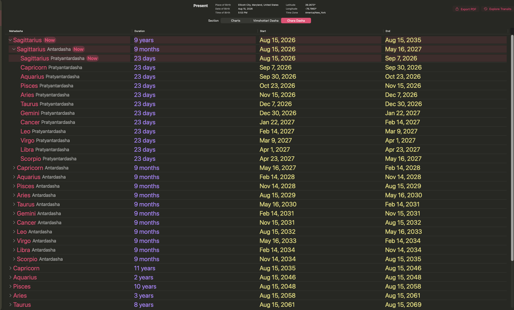

### Explore Transits
Scrub a saved chart's date/time forward or backward and watch planetary
positions recompute live, without modifying the original saved chart.

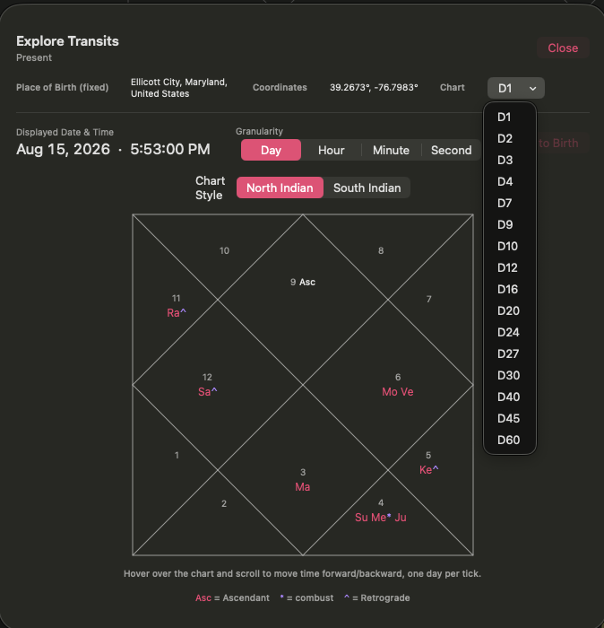

### Export PDF
Choose a chart style and any subset of D1 + divisional charts to export
as a light/print-themed PDF.

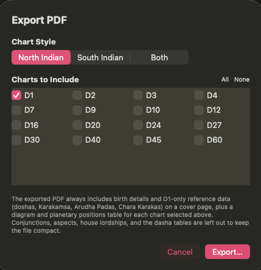

### Themes
30 built-in color/text themes, including several based on well-known
editor themes.

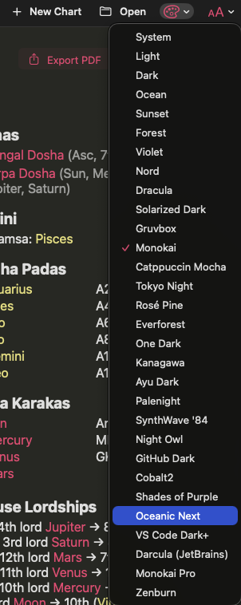

## Requirements

- macOS 26.5 or later (see `MACOSX_DEPLOYMENT_TARGET` in the Xcode
  project) to run the built app.
- Xcode 17 or later, with Swift 6.3 toolchain, to build it.

## Project Structure

Only the folders needed to build and run the app are listed below (test
targets are omitted):

```
Destiny/
├── Destiny.xcodeproj/           Xcode project -- app target, links DestinyEngine as a local SPM package
├── Destiny/                     macOS app target (SwiftUI)
│   ├── DestinyApp.swift             @main entry point; menu commands (zoom, open chart)
│   ├── ContentView.swift            Root view; theme + font-zoom environment setup
│   ├── Models/                      App-level models (persistence/UI, not calculation)
│   │   ├── ChartRecord.swift            In-memory chart + the on-disk ChartFile/ChartInput shape
│   │   ├── ChartIndexEntry.swift        SwiftData row backing the sidebar chart list
│   │   ├── ColorTheme.swift             The 30 color/text themes
│   │   ├── FontZoom.swift               Cmd +/- text size system
│   │   ├── ChartSizeZoom.swift          Independent +/- chart-diagram size control
│   │   ├── AppearanceMode.swift         Forced light/dark appearance
│   │   └── Gender.swift
│   ├── Views/                       All SwiftUI views
│   │   ├── SavedChartsListView.swift        Sidebar: search + chart list (New/Open/Theme/Font Size live in the window toolbar)
│   │   ├── ChartInputFormView.swift         New/Edit chart form
│   │   ├── ChartDetailView.swift            Tab host: Charts / Vimshottari Dasha / Chara Dasha
│   │   ├── NorthIndianChartView.swift       Chart diagram, North Indian style
│   │   ├── SouthIndianChartView.swift       Chart diagram, South Indian style
│   │   ├── ChartLayoutData.swift            Shared chart-diagram data prep (placements, hover aspects)
│   │   ├── ChartTableView.swift             D1 planetary positions table
│   │   ├── DivisionalChartsView.swift       D1 + D2-D60 varga picker + diagram + panels + table (one shared page)
│   │   ├── AnalysisPanelView.swift          Conjunctions/Graha Drishti/Rashi Drishti/House Lordships panel
│   │   ├── D1ReferencePanelView.swift       Doshas/Jaimini/Arudha Padas/Chara Karakas panel (D1-only)
│   │   ├── VimshottariDashaView.swift       Vimshottari Dasha table, current-period highlight
│   │   ├── CharaDashaView.swift             Chara Dasha table, current-period highlight
│   │   ├── TransitExplorerView.swift        Read-only live transit scrubber
│   │   ├── ChartPDFExporter.swift           Export PDF rendering (cover page + one page per selected chart)
│   │   ├── PDFExportOptionsView.swift       Export PDF options sheet (chart style, chart selection)
│   │   ├── DashaDateFormatter.swift         Date/duration formatting, chart legend text builder
│   │   └── ...                              (display-name/render-style helpers)
│   ├── Persistence/
│   │   ├── ChartStore.swift             Save/load chart JSON; recomputes on every load
│   │   └── ImportChartNotification.swift    App-menu-command notifications (Open Chart..., About)
│   ├── Geocoding/
│   │   ├── PlaceLookup.swift             Offline place-of-birth search (bundled SQLite)
│   │   └── PlaceSearchResult.swift
│   ├── Resources/
│   │   ├── GeoNamesCities.db             Bundled offline place database
│   │   └── VENDOR.md                     Provenance + rebuild steps for the db
│   └── Assets.xcassets/                  App icon, accent color
│
└── DestinyEngine/                Local Swift Package -- all astrology calculation logic
    ├── Package.swift
    ├── Sources/
    │   ├── DestinyEngine/                Pure Swift: charts, vargas, dashas, doshas, karakas, ...
    │   │   ├── VargaAnalysis.swift           Conjunctions/graha drishti/rashi drishti/lordships, shared by D1 and every varga
    │   │   └── Resources/Ephemeris/          Swiss Ephemeris data files (sepl_18.se1, semo_18.se1)
    │   └── CSwissEphemeris/              Vendored Swiss Ephemeris C library (unmodified)
    ├── LICENSE-swisseph, agpl-3.0.txt    Swiss Ephemeris licensing (AGPL-3.0)
    └── VENDOR.md                         Provenance for the vendored ephemeris library
```

## Building & Running

### Xcode

1. Open `Destiny.xcodeproj`.
2. Select the **Destiny** scheme.
3. Build & Run (`Cmd+R`). `DestinyEngine` is a local Swift package
   dependency and builds automatically as part of the app target -- no
   separate setup step.

### Command line

```bash
xcodebuild -project Destiny.xcodeproj -scheme Destiny -configuration Debug build
```

The built app lands under Xcode's DerivedData, e.g.:

```
~/Library/Developer/Xcode/DerivedData/Destiny-*/Build/Products/Debug/Destiny.app
```

To run the engine's own test suite independently of the app (useful when
only touching calculation logic):

```bash
cd DestinyEngine && swift test
```

If that fails with something like `package 'destinyengine' is using Swift
tools version 6.3.0 but the installed version is 6.2.1`, your default
`swift` (from a separate Swift toolchain install) is older than what
Xcode ships. Run it through Xcode's own toolchain instead:

```bash
cd DestinyEngine && DEVELOPER_DIR=/Applications/Xcode.app/Contents/Developer xcrun swift test
```

## Data & Persistence

- Saved charts are plain JSON files (name, place of birth, latitude/
  longitude, date/time of birth, gender, plus an id and engine version)
  written to `~/Documents` by default, or any folder the user picks via
  Open/Import. No derived output (planetary positions, dashas, etc.) is
  persisted -- it's recomputed from the raw inputs every time a chart is
  loaded, so calculation fixes automatically apply to already-saved
  charts.
- A SwiftData store (managed by the OS in the app's Application Support
  container) indexes name/place/date-of-birth and each chart's file path
  for the sidebar list -- it's just a pointer index, not a copy of the
  chart data.

## Deployment

This project is not code-signed for distribution out of the box (Xcode's
default "Sign to Run Locally" is fine for building and running on your
own Mac). To produce a build you can share or distribute:

### Release build (local use, e.g. another Mac you own)

```bash
xcodebuild -project Destiny.xcodeproj -scheme Destiny -configuration Release \
  -derivedDataPath build build
```

The signed-for-local-use app is at `build/Build/Products/Release/Destiny.app`
-- copy it directly to `/Applications` on the target Mac.

### Distributing to other people (Developer ID + notarization)

Distributing outside the Mac App Store to Macs you don't control requires
an [Apple Developer Program](https://developer.apple.com/programs/)
membership, a **Developer ID Application** signing certificate, and
notarization so Gatekeeper doesn't block launch on first open:

1. In Xcode, set the target's Signing & Capabilities to your Developer ID
   team, then archive:
   ```bash
   xcodebuild -project Destiny.xcodeproj -scheme Destiny -configuration Release \
     archive -archivePath build/Destiny.xcarchive
   ```
2. Export a Developer-ID-signed app (requires an `exportOptions.plist`
   with `method: developer-id`):
   ```bash
   xcodebuild -exportArchive -archivePath build/Destiny.xcarchive \
     -exportPath build/Export -exportOptionsPlist exportOptions.plist
   ```
3. Notarize and staple:
   ```bash
   ditto -c -k --keepParent build/Export/Destiny.app build/Destiny.zip
   xcrun notarytool submit build/Destiny.zip --keychain-profile "<profile>" --wait
   xcrun stapler staple build/Export/Destiny.app
   ```
4. Distribute `build/Export/Destiny.app` (zipped, or inside a `.dmg`).

Mac App Store distribution instead would use `method: app-store-connect`
in `exportOptionsPlist` and `xcrun altool`/Transporter to upload -- not
covered here since it also requires enrolling the bundle ID
(`com.hyperspace.Destiny`) and provisioning in App Store Connect first.

## Licensing Notes

The whole repository is licensed under **AGPL-3.0** (see `LICENSE`) --
required because it's a combined work with the vendored Swiss Ephemeris
below, which is AGPL-3.0 itself.

- **Swiss Ephemeris** (`DestinyEngine/Sources/CSwissEphemeris`,
  `DestinyEngine/Sources/DestinyEngine/Resources/Ephemeris`) is vendored
  under the **AGPL-3.0** option (see `DestinyEngine/LICENSE-swisseph` and
  `DestinyEngine/agpl-3.0.txt`). Distributing this app in binary form
  triggers AGPL-3.0's copyleft obligations -- review those terms (or
  obtain a Swiss Ephemeris Professional License from Astrodienst instead)
  before distributing outside personal use.
- **GeoNames** data (`Destiny/Resources/GeoNamesCities.db`) is used under
  **CC BY 4.0**; the required attribution is shown in the app's About
  screen. See `Destiny/Resources/VENDOR.md` for provenance and rebuild
  steps.
